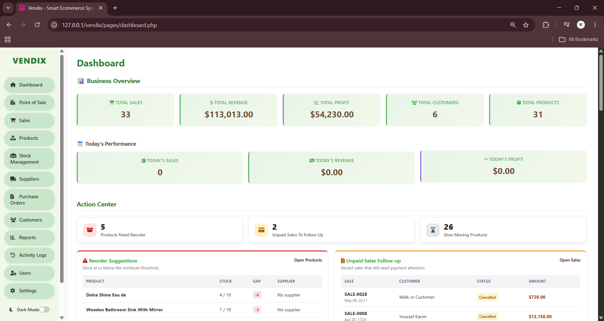
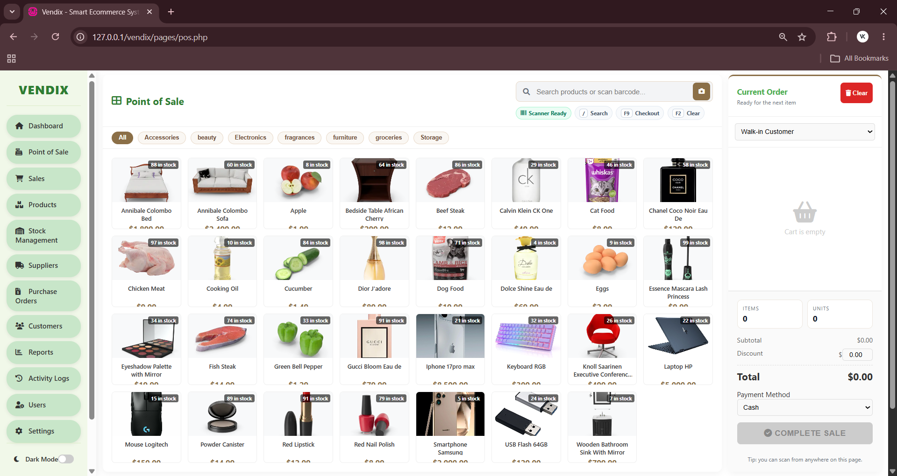
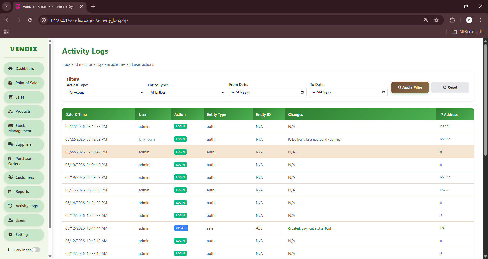

<!-- PROJECT LOGO & HEADER -->
<div align="center">
  <h1 align="center">🛒 Vendix POS & Inventory System</h1>

  <p align="center">
    A modern, high-performance web application designed to streamline retail operations, sales tracking, and inventory management.
    <br />
    <a href="#-screenshots"><strong>Explore the screenshots »</strong></a>
    <br />
    <br />
    <a href="#-installation--setup">Installation</a>
    ·
    <a href="#-features">Features</a>
    ·
    <a href="#-tech-stack">Tech Stack</a>
  </p>
</div>

<!-- BADGES -->
<div align="center">
  
  
  
  
  
</div>

---

## 📸 Screenshots

GitHub automatically extracts and displays images when using relative paths! Here is a preview of the Vendix application interfaces directly from our repository:

| Dashboard Overview | Point of Sale (POS) | Activity Logs |
|:---:|:---:|:---:|
|  |  |  |

---

## ✨ Features

- **🛒 Fast Point of Sale (POS)**: Intuitive checkout interface designed for speed, supporting barcode scanning.
- **📦 Smart Inventory Management**: Real-time stock tracking, low-stock alerts, and manual adjustment logs.
- **🚚 Supplier & Purchase Orders**: Easily create purchase orders and manage supplier deliveries.
- **📊 Detailed Analytics**: In-depth reporting for daily, monthly, and yearly sales performance.
- **🛡️ Role-Based Access Control**: Secure, multi-level permissions for Admin, Manager, Inventory, and Cashier roles.
- **📧 Automated Notifications**: PHPMailer integration for sending customer invoices and supplier orders.

---

## 🛠️ Tech Stack

- **Backend**: PHP (Vanilla)
- **Database**: MySQL / MariaDB
- **Frontend**: HTML5, CSS3, JavaScript (Vanilla)
- **Styling**: Custom CSS (Responsive & Modern UI)
- **Third-Party Libraries**: PHPMailer

---

## 📂 Project Structure

```text
vendix/
├── api/                    # Backend API endpoints (JSON responses)
├── assets/                 # Static assets (CSS, JS, Images)
├── config/                 # Configuration files (DB, Auth, Helpers)
├── database/               # Database SQL schema and demo data
├── docs/                   # Documentation (.md files & Screenshots)
├── includes/               # Reusable UI components (Header, Sidebar, etc.)
├── pages/                  # Main application views (Dashboard, POS, etc.)
├── utils/                  # Utility services (PHPMailer)
├── index.php               # Application entry point
└── login.php               # Secure login portal
```

---

## 🚀 Installation & Setup

Follow these steps to get a local copy up and running quickly.

### 1. Prerequisites
You need a local server environment such as **WampServer** or **XAMPP**.
- [Download WampServer](http://www.wampserver.com/en/) or [Download XAMPP](https://www.apachefriends.org/index.html).

### 2. Clone or Copy the Repository
Place the project folder into your local server's web root directory:
- **WAMP**: `C:\wamp64\www\vendix`
- **XAMPP**: `C:\xampp\htdocs\vendix`

### 3. Database Configuration
1. Open **phpMyAdmin**: [http://localhost/phpmyadmin](http://localhost/phpmyadmin).
2. Log in using the default credentials (Username: `root`, Password: *Leave blank*).
3. Create a new database and name it **`vendix`**. *(Collation: `utf8mb4_general_ci`)*.
4. Go to the **Import** tab, select the `database/vendix.sql` file from the project, and click **Import**.

### 4. Link Application to Database
The application is pre-configured to use the default WAMP/XAMPP settings. If needed, open `config/db.php` and verify the settings are as follows:

```php
define('DB_HOST', 'localhost');
define('DB_USER', 'root');   // Default XAMPP/WAMP user
define('DB_PASS', '');       // Default XAMPP/WAMP password (empty string)
define('DB_NAME', 'vendix'); // Database you just created
```

---

## 💻 Usage & Demo Accounts

Navigate to **`http://localhost/vendix`** in your browser. Use the credentials below to explore the different permission levels.

> **🔐 Universal Password for all demo accounts: `123456`**

| Role | Username | Access Level |
| :--- | :--- | :--- |
| **Admin** | `admin` | Full control: users, settings, delete permissions, complete oversight. |
| **Manager** | `manager1` | Products, customers, suppliers, reports. (No POS access). |
| **Inventory** | `manager2` | Stock adjustments, product catalogs, supplier purchase orders. |
| **Cashier** | `seller1` | Restricted environment. Primarily uses the POS and views products. |

---

## 📝 Documentation
For deeper technical insights, including table structures and data relationships, refer to our [Database Architecture Guide](docs/database.md).

---
<div align="center">
  <p><i>Developed to simplify your sales and elevate your business.</i></p>
</div>
