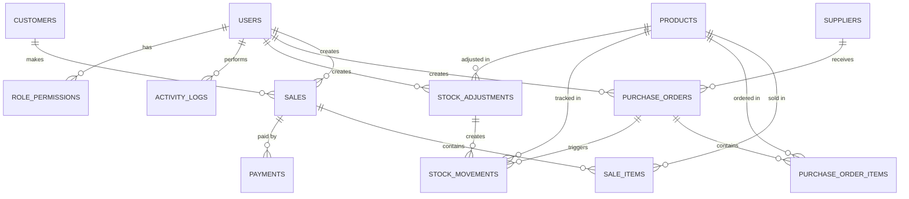

# 🗄️ Vendix - Database Architecture & Logic

## 📖 Overview
The `vendix` database is the core of the Vendix application, designed using relational database principles (MySQL/MariaDB). It ensures robust data integrity through structured foreign keys and cascading relationships.

---

## 📑 Table of Contents
- [Core Logic & Relationships](#-core-logic--relationships)
- [Database Tables & Demo Data](#-database-tables--demo-data-summary)
- [Entity Relationship Diagram](#-entity-relationship-diagram)
- [Detailed Table Specifications](#-detailed-table-specifications)
- [Database Relationships & Foreign Keys](#-database-relationships--foreign-keys)
- [Indexes & Performance](#-indexes--performance)
- [Sample Queries](#-sample-queries)
- [Data Integrity Rules](#-data-integrity-rules)
- [Backup & Maintenance](#-backup--maintenance)
- [Known Limitations](#-known-limitations)
- [Schema Migration Guide](#-schema-migration-guide)

---

## 🧠 Core Logic & Relationships

- **🛒 Sales Flow**: A `sale` is linked to a `customer` and a `user` (cashier). Each sale contains multiple `sale_items`, which reference specific `products`. When a sale is completed, the product stock is reduced automatically. Payments are meticulously tracked in the `payments` table.
- **📦 Inventory & Purchasing Flow**: `purchase_orders` are linked to `suppliers` and `users`. They contain `purchase_order_items`. When items are marked as "Received", the stock of the respective `products` is automatically increased, and a log is created in `stock_movements`.
- **⚖️ Stock Adjustments**: Manual corrections, damage reports, or returns are seamlessly handled via the `stock_adjustments` table, which triggers `stock_movements` to maintain an accurate audit trail.
- **🔐 Authentication & RBAC**: The `users` table holds secure accounts. Access to specific application modules is dynamically governed by the `role_permissions` table.
- **📜 Activity Auditing**: The `activity_logs` table stores an immutable history of important actions (Create, Update, Delete, Login) for comprehensive security and auditing purposes.

---

## 🗂️ Database Tables & Demo Data Summary

### 👤 `users`
Stores system users and their roles for secure authentication.

| ID | Username | Role | Status | Force Logout |
| :--- | :--- | :--- | :--- | :--- |
| 1 | `admin` | Admin | Active | 0 |
| 2 | `seller3` | Cashier | Active | 0 |
| 3 | `manager1` | Manager | Active | 0 |

### 🔑 `role_permissions`
Defines granular module-level access for each role (Dynamic RBAC).

| ID | Role Name | Permission Key | Is Allowed |
| :--- | :--- | :--- | :--- |
| 1 | manager | `view_dashboard` | 1 |
| 2 | manager | `view_pos` | 0 |
| 11 | cashier | `view_pos` | 1 |

### 👥 `customers`
Stores customer details for seamless invoicing and tracking.

| ID | Name | Phone | Email |
| :--- | :--- | :--- | :--- |
| 1 | Ahmed Benali | 0600076501 | ahmed@mail.com |
| 2 | Sara El Amrani | 0600000002 | sara@mail.com |

### 🏢 `suppliers`
Stores vendor information providing the products.

| ID | Name | Contact Person | Phone | Email |
| :--- | :--- | :--- | :--- | :--- |
| 1 | TechParts Morocco | Ahmed | 0600112233 | info@techparts.ma |

### 🏷️ `products`
Stores inventory items, current stock levels, and pricing metrics.

| ID | Name | SKU | Price | Cost Price | Stock | Min Stock | Category |
| :--- | :--- | :--- | :--- | :--- | :--- | :--- | :--- |
| 1 | Laptop HP | SKU-00001 | 5000.00 | 3000.00 | 23 | 10 | Electronics |
| 2 | Mouse Logitech| SKU-00002 | 150.00 | 80.00 | 16 | 10 | Accessories |

### 🧾 `sales` & `sale_items`
Tracks transactions and the specific products sold within them.

**`sales`**
| ID | Customer ID | User ID | Payment Status | Total Amount |
| :--- | :--- | :--- | :--- | :--- |
| 1 | 1 | 5 | Paid | 5150.00 |

### 🚚 `purchase_orders` & `purchase_order_items`
Tracks inventory orders dynamically sent to suppliers.

**`purchase_orders`**
| ID | Supplier ID | Status | Total Cost |
| :--- | :--- | :--- | :--- |
| 1 | 1 | ordered | 15000.00 |

### ⚙️ `settings`
Stores dynamic application configurations (e.g., SMTP setup, app name).

| ID | Setting Key | Setting Value |
| :--- | :--- | :--- |
| 1 | `app_name` | Vendix |
| 7 | `smtp_host` | smtp.gmail.com |

### 🛡️ `activity_logs`
Immutable audit trail of critical user actions.

| ID | User ID | Action Type | Entity Type | Description |
| :--- | :--- | :--- | :--- | :--- |
| 1 | 1 | LOGIN | auth | User logged in |
| 2 | 5 | CREATE | sale | Created sale with 2 item(s) |

---

## 🔗 Entity Relationship Diagram



---

## 📋 Detailed Table Specifications

### 👤 `users`
Stores system users with authentication and role management.

| Field | Type | Constraints | Description |
| :--- | :--- | :--- | :--- |
| `id` | INT | PRIMARY KEY, AUTO_INCREMENT | Unique user identifier |
| `username` | VARCHAR(50) | UNIQUE, NOT NULL | Login username |
| `email` | VARCHAR(100) | UNIQUE, NOT NULL | User email address |
| `password` | VARCHAR(255) | NOT NULL | Hashed password (Bcrypt) |
| `role` | ENUM('Admin','Manager','Inventory','Cashier') | NOT NULL | User permission level |
| `full_name` | VARCHAR(100) | NULL | User's full name |
| `phone` | VARCHAR(20) | NULL | Contact phone number |
| `status` | ENUM('Active','Inactive','Suspended') | DEFAULT 'Active' | Account status |
| `force_logout` | BOOLEAN | DEFAULT 0 | Force user to logout |
| `last_login` | DATETIME | NULL | Last login timestamp |
| `created_at` | TIMESTAMP | DEFAULT CURRENT_TIMESTAMP | Account creation time |
| `updated_at` | TIMESTAMP | DEFAULT CURRENT_TIMESTAMP ON UPDATE CURRENT_TIMESTAMP | Last update time |

**Indexes**: `username` (UNIQUE), `email` (UNIQUE), `role`, `status`

---

### 🔑 `role_permissions`
Defines granular module-level access control for each role.

| Field | Type | Constraints | Description |
| :--- | :--- | :--- | :--- |
| `id` | INT | PRIMARY KEY, AUTO_INCREMENT | Unique permission identifier |
| `role_name` | VARCHAR(50) | NOT NULL, INDEX | Role name (Admin, Manager, etc.) |
| `permission_key` | VARCHAR(100) | NOT NULL | Module access key |
| `is_allowed` | BOOLEAN | DEFAULT 1 | Permission granted (1) or denied (0) |
| `created_at` | TIMESTAMP | DEFAULT CURRENT_TIMESTAMP | Creation timestamp |

**Permission Keys Available**:
- `view_dashboard`, `view_pos`, `view_products`, `view_customers`, `view_sales`, `view_inventory`
- `create_sale`, `create_product`, `create_user`, `create_purchase_order`
- `edit_product`, `edit_user`, `delete_product`, `delete_user`
- `view_reports`, `view_activity_logs`, `manage_settings`

---

### 👥 `customers`
Stores customer information for invoicing and sales tracking.

| Field | Type | Constraints | Description |
| :--- | :--- | :--- | :--- |
| `id` | INT | PRIMARY KEY, AUTO_INCREMENT | Unique customer ID |
| `name` | VARCHAR(100) | NOT NULL | Customer full name |
| `email` | VARCHAR(100) | UNIQUE, NULL | Customer email |
| `phone` | VARCHAR(20) | NOT NULL | Contact number |
| `address` | TEXT | NULL | Delivery address |
| `city` | VARCHAR(50) | NULL | City name |
| `postal_code` | VARCHAR(20) | NULL | Postal/ZIP code |
| `country` | VARCHAR(50) | NULL | Country |
| `total_spent` | DECIMAL(12,2) | DEFAULT 0.00 | Total purchase amount |
| `total_orders` | INT | DEFAULT 0 | Count of orders |
| `last_purchase` | DATE | NULL | Last purchase date |
| `status` | ENUM('Active','Inactive') | DEFAULT 'Active' | Customer status |
| `created_at` | TIMESTAMP | DEFAULT CURRENT_TIMESTAMP | Account creation |
| `updated_at` | TIMESTAMP | DEFAULT CURRENT_TIMESTAMP ON UPDATE CURRENT_TIMESTAMP | Last update |

**Indexes**: `email`, `phone`, `status`, `created_at`

---

### 🏢 `suppliers`
Vendor information for purchase ordering.

| Field | Type | Constraints | Description |
| :--- | :--- | :--- | :--- |
| `id` | INT | PRIMARY KEY, AUTO_INCREMENT | Unique supplier ID |
| `name` | VARCHAR(100) | NOT NULL, UNIQUE | Supplier company name |
| `contact_person` | VARCHAR(100) | NOT NULL | Contact person name |
| `email` | VARCHAR(100) | NOT NULL | Contact email |
| `phone` | VARCHAR(20) | NOT NULL | Contact phone |
| `address` | TEXT | NULL | Supplier address |
| `city` | VARCHAR(50) | NULL | City |
| `postal_code` | VARCHAR(20) | NULL | Postal code |
| `country` | VARCHAR(50) | NULL | Country |
| `payment_terms` | VARCHAR(100) | NULL | Payment terms (e.g., Net 30) |
| `status` | ENUM('Active','Inactive') | DEFAULT 'Active' | Supplier status |
| `created_at` | TIMESTAMP | DEFAULT CURRENT_TIMESTAMP | Record creation |
| `updated_at` | TIMESTAMP | DEFAULT CURRENT_TIMESTAMP ON UPDATE CURRENT_TIMESTAMP | Last update |

**Indexes**: `name` (UNIQUE), `status`

---

### 🏷️ `products`
Core inventory items with pricing and stock management.

| Field | Type | Constraints | Description |
| :--- | :--- | :--- | :--- |
| `id` | INT | PRIMARY KEY, AUTO_INCREMENT | Unique product ID |
| `name` | VARCHAR(150) | NOT NULL | Product name |
| `description` | TEXT | NULL | Product description |
| `sku` | VARCHAR(50) | UNIQUE, NOT NULL | Stock Keeping Unit |
| `barcode` | VARCHAR(100) | UNIQUE, NULL | Barcode for scanning |
| `category` | VARCHAR(100) | NULL, INDEX | Product category |
| `supplier_id` | INT | NULL, FOREIGN KEY | Primary supplier reference |
| `cost_price` | DECIMAL(10,2) | NOT NULL | Product cost |
| `selling_price` | DECIMAL(10,2) | NOT NULL | Product selling price |
| `stock_quantity` | INT | DEFAULT 0 | Current stock level |
| `min_stock_level` | INT | DEFAULT 10 | Low stock threshold |
| `max_stock_level` | INT | NULL | Maximum stock level |
| `unit_of_measure` | VARCHAR(20) | DEFAULT 'piece' | Units (piece, kg, liter, etc.) |
| `image_url` | VARCHAR(255) | NULL | Product image path |
| `is_active` | BOOLEAN | DEFAULT 1 | Product availability |
| `created_at` | TIMESTAMP | DEFAULT CURRENT_TIMESTAMP | Record creation |
| `updated_at` | TIMESTAMP | DEFAULT CURRENT_TIMESTAMP ON UPDATE CURRENT_TIMESTAMP | Last update |

**Indexes**: `sku` (UNIQUE), `barcode` (UNIQUE), `category`, `supplier_id`, `is_active`

---

### 💳 `sales`
Records of all sales transactions.

| Field | Type | Constraints | Description |
| :--- | :--- | :--- | :--- |
| `id` | INT | PRIMARY KEY, AUTO_INCREMENT | Unique sale ID |
| `invoice_number` | VARCHAR(50) | UNIQUE, NOT NULL | Invoice reference |
| `customer_id` | INT | FOREIGN KEY users.id | Customer making purchase |
| `cashier_id` | INT | NOT NULL, FOREIGN KEY | Cashier processing sale |
| `total_amount` | DECIMAL(12,2) | NOT NULL | Total sale amount |
| `discount_percentage` | DECIMAL(5,2) | DEFAULT 0 | Applied discount % |
| `discount_amount` | DECIMAL(10,2) | DEFAULT 0 | Discount in currency |
| `tax_amount` | DECIMAL(10,2) | DEFAULT 0 | Tax amount |
| `final_amount` | DECIMAL(12,2) | NOT NULL | Amount after discount/tax |
| `payment_status` | ENUM('Pending','Paid','Partial','Cancelled') | DEFAULT 'Pending' | Payment status |
| `payment_method` | ENUM('Cash','Card','Check','Bank Transfer','Other') | NULL | Payment method |
| `notes` | TEXT | NULL | Sale notes |
| `status` | ENUM('Completed','Cancelled','Returned') | DEFAULT 'Completed' | Sale status |
| `created_at` | TIMESTAMP | DEFAULT CURRENT_TIMESTAMP | Sale time |
| `updated_at` | TIMESTAMP | DEFAULT CURRENT_TIMESTAMP ON UPDATE CURRENT_TIMESTAMP | Last update |

**Indexes**: `invoice_number` (UNIQUE), `customer_id`, `cashier_id`, `created_at`, `payment_status`

---

### 🧾 `sale_items`
Individual items within each sale transaction.

| Field | Type | Constraints | Description |
| :--- | :--- | :--- | :--- |
| `id` | INT | PRIMARY KEY, AUTO_INCREMENT | Unique sale item ID |
| `sale_id` | INT | NOT NULL, FOREIGN KEY | Parent sale reference |
| `product_id` | INT | NOT NULL, FOREIGN KEY | Product sold |
| `quantity` | INT | NOT NULL | Units sold |
| `unit_price` | DECIMAL(10,2) | NOT NULL | Price per unit at time of sale |
| `total_price` | DECIMAL(12,2) | NOT NULL | Quantity × Unit Price |
| `created_at` | TIMESTAMP | DEFAULT CURRENT_TIMESTAMP | Record creation |

**Indexes**: `sale_id`, `product_id`

---

### 💰 `payments`
Tracks payment records for each sale.

| Field | Type | Constraints | Description |
| :--- | :--- | :--- | :--- |
| `id` | INT | PRIMARY KEY, AUTO_INCREMENT | Unique payment ID |
| `sale_id` | INT | NOT NULL, FOREIGN KEY | Sale being paid |
| `amount` | DECIMAL(12,2) | NOT NULL | Payment amount |
| `payment_method` | ENUM('Cash','Card','Check','Bank Transfer','Other') | NOT NULL | Payment method |
| `reference_number` | VARCHAR(100) | NULL | Transaction/check number |
| `status` | ENUM('Completed','Pending','Failed') | DEFAULT 'Completed' | Payment status |
| `paid_at` | DATETIME | NOT NULL | Payment timestamp |
| `notes` | TEXT | NULL | Payment notes |
| `created_at` | TIMESTAMP | DEFAULT CURRENT_TIMESTAMP | Record creation |

**Indexes**: `sale_id`, `paid_at`, `payment_method`

---

### 🚚 `purchase_orders`
Vendor purchase orders for restocking inventory.

| Field | Type | Constraints | Description |
| :--- | :--- | :--- | :--- |
| `id` | INT | PRIMARY KEY, AUTO_INCREMENT | Unique PO ID |
| `po_number` | VARCHAR(50) | UNIQUE, NOT NULL | PO reference number |
| `supplier_id` | INT | NOT NULL, FOREIGN KEY | Supplier for order |
| `created_by` | INT | NOT NULL, FOREIGN KEY | User creating PO |
| `expected_delivery_date` | DATE | NULL | Expected arrival date |
| `actual_delivery_date` | DATE | NULL | Actual arrival date |
| `total_cost` | DECIMAL(12,2) | NOT NULL | PO total cost |
| `status` | ENUM('Draft','Ordered','Partially Received','Received','Cancelled') | DEFAULT 'Draft' | PO status |
| `notes` | TEXT | NULL | PO notes |
| `created_at` | TIMESTAMP | DEFAULT CURRENT_TIMESTAMP | Creation time |
| `updated_at` | TIMESTAMP | DEFAULT CURRENT_TIMESTAMP ON UPDATE CURRENT_TIMESTAMP | Last update |

**Indexes**: `po_number` (UNIQUE), `supplier_id`, `status`, `created_at`

---

### 📦 `purchase_order_items`
Individual items in purchase orders.

| Field | Type | Constraints | Description |
| :--- | :--- | :--- | :--- |
| `id` | INT | PRIMARY KEY, AUTO_INCREMENT | Unique PO item ID |
| `purchase_order_id` | INT | NOT NULL, FOREIGN KEY | Parent PO |
| `product_id` | INT | NOT NULL, FOREIGN KEY | Product ordered |
| `quantity_ordered` | INT | NOT NULL | Units ordered |
| `quantity_received` | INT | DEFAULT 0 | Units received |
| `unit_cost` | DECIMAL(10,2) | NOT NULL | Cost per unit |
| `total_cost` | DECIMAL(12,2) | NOT NULL | Quantity × Unit Cost |
| `created_at` | TIMESTAMP | DEFAULT CURRENT_TIMESTAMP | Record creation |

**Indexes**: `purchase_order_id`, `product_id`

---

### 📊 `stock_movements`
Audit trail for all inventory changes (sales, purchases, adjustments).

| Field | Type | Constraints | Description |
| :--- | :--- | :--- | :--- |
| `id` | INT | PRIMARY KEY, AUTO_INCREMENT | Unique movement ID |
| `product_id` | INT | NOT NULL, FOREIGN KEY | Product affected |
| `movement_type` | ENUM('Sale','Purchase','Adjustment','Return','Damage') | NOT NULL | Type of movement |
| `quantity_change` | INT | NOT NULL | Units added (positive) or removed (negative) |
| `previous_quantity` | INT | NOT NULL | Stock before movement |
| `new_quantity` | INT | NOT NULL | Stock after movement |
| `reference_id` | INT | NULL | Sale/PO/Adjustment ID |
| `reference_type` | VARCHAR(50) | NULL | Type of reference |
| `notes` | TEXT | NULL | Movement details |
| `created_by` | INT | NULL, FOREIGN KEY | User who triggered movement |
| `created_at` | TIMESTAMP | DEFAULT CURRENT_TIMESTAMP | Movement timestamp |

**Indexes**: `product_id`, `movement_type`, `created_at`, `reference_id`

---

### ⚖️ `stock_adjustments`
Manual inventory corrections and adjustments.

| Field | Type | Constraints | Description |
| :--- | :--- | :--- | :--- |
| `id` | INT | PRIMARY KEY, AUTO_INCREMENT | Unique adjustment ID |
| `product_id` | INT | NOT NULL, FOREIGN KEY | Product adjusted |
| `adjustment_type` | ENUM('Correction','Damage','Return','Theft','Other') | NOT NULL | Reason for adjustment |
| `quantity_change` | INT | NOT NULL | Units added/removed |
| `previous_quantity` | INT | NOT NULL | Stock before |
| `new_quantity` | INT | NOT NULL | Stock after |
| `reason` | TEXT | NOT NULL | Detailed reason |
| `created_by` | INT | NOT NULL, FOREIGN KEY | Staff member making adjustment |
| `approved_by` | INT | NULL, FOREIGN KEY | Manager approval |
| `approval_status` | ENUM('Pending','Approved','Rejected') | DEFAULT 'Pending' | Approval status |
| `created_at` | TIMESTAMP | DEFAULT CURRENT_TIMESTAMP | Adjustment time |

**Indexes**: `product_id`, `approval_status`, `created_at`

---

### ⚙️ `settings`
Dynamic application configurations.

| Field | Type | Constraints | Description |
| :--- | :--- | :--- | :--- |
| `id` | INT | PRIMARY KEY, AUTO_INCREMENT | Unique setting ID |
| `setting_key` | VARCHAR(100) | UNIQUE, NOT NULL | Configuration key |
| `setting_value` | LONGTEXT | NULL | Configuration value |
| `setting_type` | VARCHAR(50) | NULL | Data type (string, number, boolean) |
| `description` | TEXT | NULL | Setting description |
| `is_editable` | BOOLEAN | DEFAULT 1 | User can modify |
| `updated_at` | TIMESTAMP | DEFAULT CURRENT_TIMESTAMP ON UPDATE CURRENT_TIMESTAMP | Last update |

**Common Settings**:
- `app_name` - Application name
- `app_currency` - Currency symbol
- `tax_percentage` - Default tax rate
- `smtp_host`, `smtp_port`, `smtp_user` - Email config
- `low_stock_alert` - Stock alert threshold
- `backup_frequency` - Backup schedule

**Indexes**: `setting_key` (UNIQUE)

---

### 🛡️ `activity_logs`
Immutable audit trail of all system operations.

| Field | Type | Constraints | Description |
| :--- | :--- | :--- | :--- |
| `id` | INT | PRIMARY KEY, AUTO_INCREMENT | Unique log ID |
| `user_id` | INT | NOT NULL, FOREIGN KEY | User performing action |
| `action_type` | ENUM('CREATE','READ','UPDATE','DELETE','LOGIN','LOGOUT','EXPORT') | NOT NULL | Operation type |
| `entity_type` | VARCHAR(50) | NOT NULL | Entity affected (sale, product, etc.) |
| `entity_id` | INT | NULL | ID of affected entity |
| `old_values` | JSON | NULL | Previous values (for UPDATE) |
| `new_values` | JSON | NULL | New values (for UPDATE/CREATE) |
| `description` | TEXT | NOT NULL | Human-readable description |
| `ip_address` | VARCHAR(50) | NULL | User's IP address |
| `user_agent` | TEXT | NULL | Browser user agent |
| `status` | ENUM('Success','Failed') | DEFAULT 'Success' | Operation outcome |
| `created_at` | TIMESTAMP | DEFAULT CURRENT_TIMESTAMP | Log timestamp |

**Indexes**: `user_id`, `action_type`, `entity_type`, `created_at`

---

## 🔗 Database Relationships & Foreign Keys

### Sales Flow
```
Users (Cashier)
  └─> Sales (sale_id → user_id)
       └─> Sale Items (sale_item_id → sale_id)
            └─> Products (product_id)
                 └─> Stock Movements (negative quantity)
       └─> Payments (sale_id)
       └─> Activity Logs (entity_id = sale_id)
Customer
  └─> Sales (sale_id → customer_id)
```

### Inventory Flow
```
Suppliers
  └─> Purchase Orders (po_id → supplier_id)
       └─> Purchase Order Items (poi_id → po_id)
            └─> Products (product_id)
                 └─> Stock Movements (positive quantity)
       └─> Activity Logs
```

### Stock Management
```
Products
  ├─> Stock Movements (for every change)
  ├─> Stock Adjustments (for manual corrections)
  └─> Activity Logs (for compliance)
```

### Access Control
```
Users (role)
  └─> Role Permissions (role_name)
       └─> Access to modules/operations
```

---

## 📈 Indexes & Performance

### Primary Indexes (Unique)
- `users.username` - For login lookups
- `users.email` - For user searches
- `customers.email` - For customer lookups
- `suppliers.name` - For supplier searches
- `products.sku` - For inventory tracking
- `products.barcode` - For POS scanning
- `sales.invoice_number` - For invoice lookup
- `purchase_orders.po_number` - For PO tracking

### Secondary Indexes (Search/Filter)
- `users.role` - For permission checks
- `users.status` - For active user queries
- `customers.status` - For active customer queries
- `products.category` - For category filtering
- `products.supplier_id` - For supplier inventory
- `sales.customer_id` - For customer sales history
- `sales.cashier_id` - For cashier performance
- `sales.created_at` - For date range queries
- `purchase_orders.status` - For PO status filtering
- `stock_movements.product_id` - For inventory audit
- `activity_logs.user_id` - For user activity audit
- `activity_logs.created_at` - For date range queries

### Recommended Composite Indexes
```sql
-- For sales reporting
CREATE INDEX idx_sales_date_customer ON sales(created_at, customer_id);

-- For inventory analysis
CREATE INDEX idx_stock_movements_product_date ON stock_movements(product_id, created_at);

-- For activity audit
CREATE INDEX idx_activity_logs_user_action ON activity_logs(user_id, action_type, created_at);
```

---

## 💡 Sample Queries

### Sales Analytics
```sql
-- Daily sales total
SELECT DATE(created_at) as sale_date, COUNT(*) as total_sales, SUM(final_amount) as revenue
FROM sales
WHERE created_at >= DATE_SUB(NOW(), INTERVAL 30 DAY) AND status = 'Completed'
GROUP BY DATE(created_at)
ORDER BY sale_date DESC;

-- Top products by revenue
SELECT p.id, p.name, SUM(si.quantity) as units_sold, SUM(si.total_price) as revenue
FROM products p
JOIN sale_items si ON p.id = si.product_id
JOIN sales s ON si.sale_id = s.id
WHERE s.created_at >= DATE_SUB(NOW(), INTERVAL 30 DAY) AND s.status = 'Completed'
GROUP BY p.id
ORDER BY revenue DESC
LIMIT 10;

-- Customer purchase history
SELECT s.id, s.invoice_number, s.final_amount, s.created_at
FROM sales s
WHERE s.customer_id = ? AND s.status = 'Completed'
ORDER BY s.created_at DESC;
```

### Inventory Management
```sql
-- Low stock alerts
SELECT id, name, sku, stock_quantity, min_stock_level
FROM products
WHERE stock_quantity <= min_stock_level AND is_active = 1
ORDER BY stock_quantity ASC;

-- Stock movement history for product
SELECT movement_type, quantity_change, previous_quantity, new_quantity, notes, created_at
FROM stock_movements
WHERE product_id = ? AND created_at >= DATE_SUB(NOW(), INTERVAL 90 DAY)
ORDER BY created_at DESC;

-- Supplier performance (on-time delivery)
SELECT s.id, s.name, 
  COUNT(po.id) as total_orders,
  SUM(CASE WHEN actual_delivery_date <= expected_delivery_date THEN 1 ELSE 0 END) as on_time,
  ROUND(SUM(CASE WHEN actual_delivery_date <= expected_delivery_date THEN 1 ELSE 0 END) / COUNT(po.id) * 100, 2) as on_time_percentage
FROM suppliers s
LEFT JOIN purchase_orders po ON s.id = po.supplier_id
WHERE po.status = 'Received'
GROUP BY s.id;
```

### Audit & Compliance
```sql
-- User activity log
SELECT u.username, al.action_type, al.entity_type, al.description, al.created_at
FROM activity_logs al
JOIN users u ON al.user_id = u.id
WHERE al.created_at >= DATE_SUB(NOW(), INTERVAL 7 DAY)
ORDER BY al.created_at DESC;

-- Inventory adjustments needing approval
SELECT sa.id, p.name, sa.adjustment_type, sa.quantity_change, u.username, sa.approval_status
FROM stock_adjustments sa
JOIN products p ON sa.product_id = p.id
JOIN users u ON sa.created_by = u.id
WHERE sa.approval_status = 'Pending'
ORDER BY sa.created_at;

-- Sales by cashier
SELECT u.full_name, COUNT(s.id) as total_sales, SUM(s.final_amount) as total_revenue
FROM sales s
JOIN users u ON s.cashier_id = u.id
WHERE s.created_at >= DATE_SUB(NOW(), INTERVAL 30 DAY) AND s.status = 'Completed'
GROUP BY u.id
ORDER BY total_revenue DESC;
```

---

## 🔐 Data Integrity Rules

### Constraints & Validations
| Entity | Rule | Description |
| :--- | :--- | :--- |
| **Users** | Unique username/email | Prevents duplicate accounts |
| **Users** | Password length ≥ 8 characters | Security requirement |
| **Users** | Role must be valid enum | Restricted to 4 roles |
| **Products** | SKU must be unique | Inventory tracking |
| **Products** | Selling Price ≥ Cost Price | Profit validation |
| **Products** | Stock ≥ 0 | Cannot have negative stock |
| **Sales** | Customer must exist | Referential integrity |
| **Sales** | Cashier must exist | Valid user assignment |
| **Sales** | Final Amount ≥ 0 | Valid transaction |
| **Sale Items** | Quantity > 0 | Must sell at least 1 unit |
| **Sale Items** | Unit Price > 0 | Valid pricing |
| **Stock Movement** | Previous + Change = New | Mathematical consistency |
| **Purchase Order** | Status progression only | Draft → Ordered → Received |

### Triggers (Automated Actions)
```sql
-- Decrease product stock when sale is created
TRIGGER: sale_items_INSERT
  UPDATE products SET stock_quantity = stock_quantity - NEW.quantity
  WHERE id = NEW.product_id;

-- Increase product stock when PO is received
TRIGGER: purchase_order_items_UPDATE
  UPDATE products SET stock_quantity = stock_quantity + (NEW.quantity_received - OLD.quantity_received)
  WHERE id = NEW.product_id;

-- Create stock movement record
TRIGGER: stock_movements_INSERT (automatically logging all stock changes)
  CREATE activity log entry for audit trail
```

---

## 💾 Backup & Maintenance

### Backup Strategy
```bash
# Daily backup
mysqldump -u root -p vendix > vendix_$(date +%Y%m%d_%H%M%S).sql

# Weekly backup with compression
mysqldump -u root -p vendix | gzip > vendix_weekly_$(date +%Y%m%d).sql.gz

# Backup all databases
mysqldump -u root -p --all-databases > vendix_complete_$(date +%Y%m%d).sql
```

### Maintenance Tasks
| Task | Frequency | Purpose |
| :--- | :--- | :--- |
| Check database size | Weekly | Monitor growth |
| Optimize tables | Monthly | Improve performance |
| Backup database | Daily | Disaster recovery |
| Review activity logs | Monthly | Security audit |
| Archive old records | Quarterly | Storage management |
| Update statistics | Monthly | Query optimization |

### Restoration Procedure
```bash
# Restore from backup
mysql -u root -p vendix < vendix_backup_20260522.sql

# Verify restoration
SELECT COUNT(*) FROM sales;
SELECT COUNT(*) FROM products;
```

---

## ⚠️ Known Limitations

1. **No Multi-Tenant Support** - Single organization database
2. **No Soft Deletes** - Deleted records cannot be recovered
3. **Limited User Roles** - Only 4 predefined roles (can be extended)
4. **No Currency Conversion** - Assumes single currency
5. **No Advanced Inventory** - No serial number/batch tracking
6. **Simple RBAC** - Module-level only (no row-level security)
7. **No Data Versioning** - Only current state stored
8. **Activity Logs Unlimited Growth** - May need archiving strategy
9. **No Inventory Allocation** - Cannot reserve stock
10. **Simple Approval Workflow** - Only 2-level approval for adjustments

---

## 📝 Schema Migration Guide

### Adding a New Feature

#### Example: Customer Loyalty Points
```sql
-- 1. Add new table
CREATE TABLE customer_loyalty_points (
  id INT PRIMARY KEY AUTO_INCREMENT,
  customer_id INT NOT NULL FOREIGN KEY,
  points_earned INT DEFAULT 0,
  points_redeemed INT DEFAULT 0,
  current_points INT DEFAULT 0,
  created_at TIMESTAMP DEFAULT CURRENT_TIMESTAMP,
  updated_at TIMESTAMP DEFAULT CURRENT_TIMESTAMP ON UPDATE CURRENT_TIMESTAMP,
  INDEX idx_customer_id (customer_id)
);

-- 2. Add permission to role_permissions
INSERT INTO role_permissions (role_name, permission_key, is_allowed)
VALUES ('Cashier', 'view_loyalty_points', 1),
       ('Admin', 'manage_loyalty_points', 1);

-- 3. Update activity_logs if tracking changes
-- (Activity logs will auto-track through application code)

-- 4. Test and verify
SELECT * FROM customer_loyalty_points LIMIT 1;
```

### Modifying Existing Tables
```sql
-- Always backup first!

-- Add new column (with default)
ALTER TABLE products ADD COLUMN tax_category VARCHAR(50) DEFAULT 'standard';

-- Modify existing column
ALTER TABLE sales MODIFY COLUMN discount_percentage DECIMAL(6,3);

-- Add constraint
ALTER TABLE purchase_orders ADD CONSTRAINT check_dates 
  CHECK (expected_delivery_date >= DATE(created_at));

-- Create index for performance
CREATE INDEX idx_sales_payment_status ON sales(payment_status, created_at);
```

### Best Practices
- ✅ Always backup before schema changes
- ✅ Test migrations in development first
- ✅ Use meaningful column names
- ✅ Maintain consistent data types
- ✅ Document all changes
- ✅ Plan for scalability
- ✅ Use transactions for multiple-step changes
- ✅ Update API documentation after schema changes

---

<div align="center">
  <p><i>For the most up-to-date schema, refer to <code>database/vendix.sql</code></i></p>
</div>
